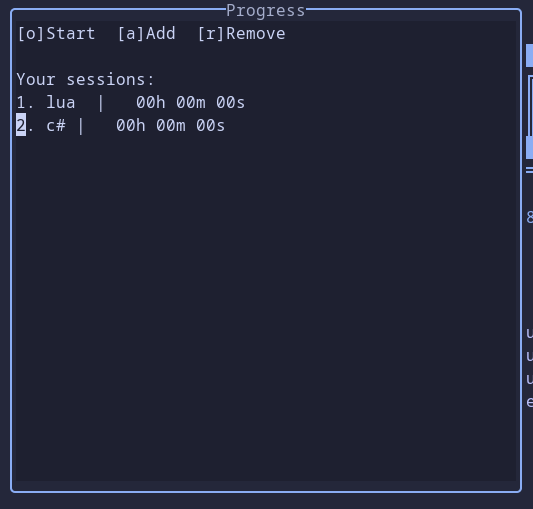

# Progress

## Overview

**Pluging currently in *BETA* version.**

Pluging for logging your work.  
Can only save time.

## Installation

`lazy`
```lua
{ "kimpors/progress.nvim" }
```

## Configuration

Default configuration:
```lua
require("progress").setup({interval = 10})
```

`interval` used for timer timeout. Accepts secconds as parameter.

## Usage

Command for executing menu `:Progress`


